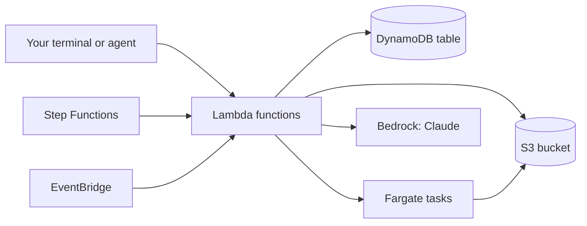
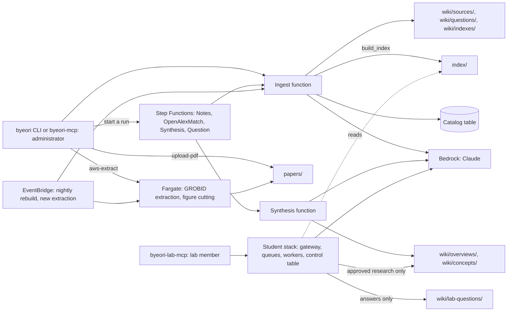
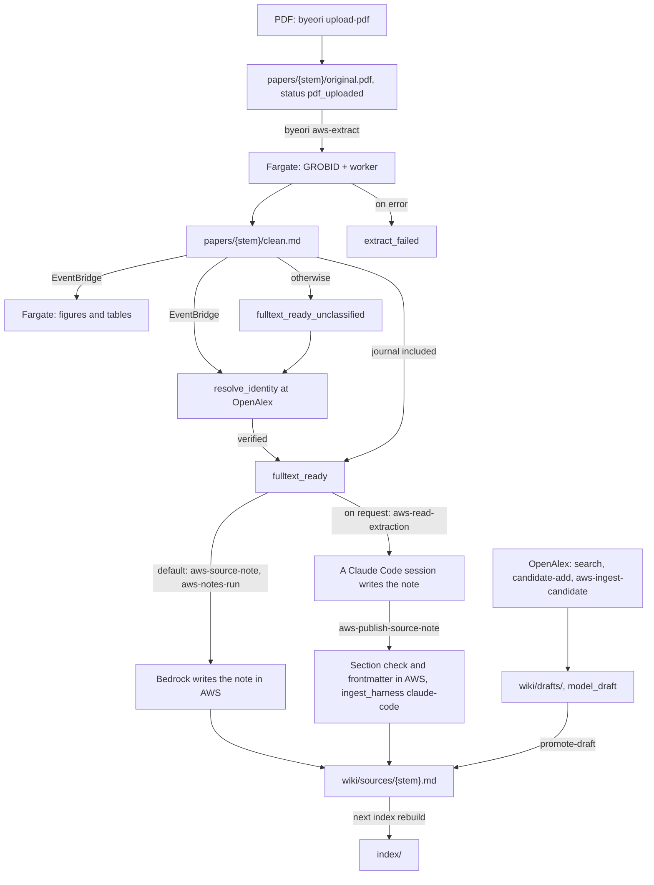
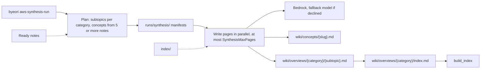
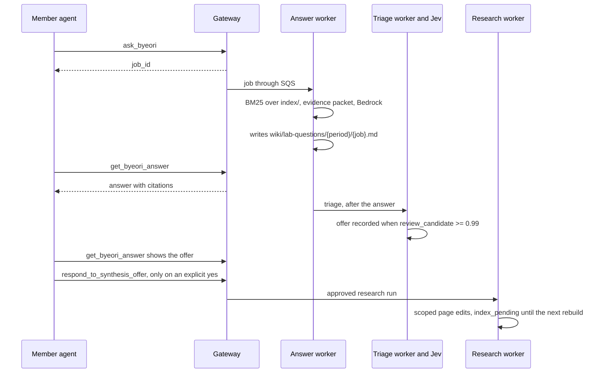
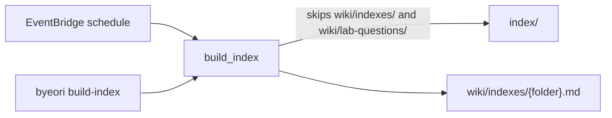
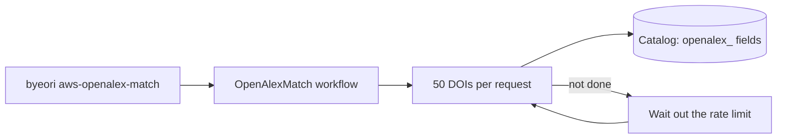
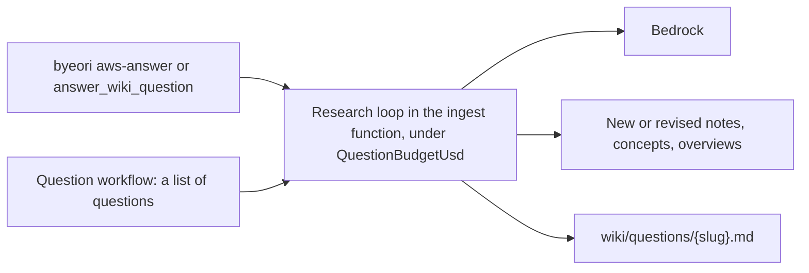

# Byeori

Byeori is a scientific knowledge system that a lab installs in its own AWS account. The original
PDF of every paper is kept in S3. A Claude model running in Amazon Bedrock reads each paper's full
text and writes one evidence note for it; further pages then synthesise across those notes. A
search index over all the pages is rebuilt in AWS, and a question service answers from the wiki
with citations. Every page records where it came from: the paper's identifiers, the hash of the
stored PDF, and the model that wrote it. This release is a public **beta**.

An evidence note starts like this (from `templates/source.md`):

```markdown
---
work_id: ""
doi: ""
title: ""
pdf_path: ""
pdf_sha256: ""
---

# Paper title

## Citation

## Methods

## Results

## Limitations

## Evidence boundary

```

## What it needs and what it costs

- An AWS account and a user in it with administrator access.
- Bedrock model access granted for the Claude models, in the region you install into.
- On your computer: a terminal, [Docker](https://docs.docker.com/get-docker/),
  [`uv`](https://docs.astral.sh/uv/) and the [AWS CLI](https://aws.amazon.com/cli/).
- A free [OpenAlex](https://openalex.org) API key, used to look papers up.

What it costs, measured by one lab at Bedrock list prices (details in `docs/COST.md`):

- **Per paper:** about $0.30 for the note on Claude Opus 5 at the shipped settings (`IngestReasoning=high`),
  or about $0.135 at `default` reasoning ($0.055 on Sonnet 5), plus about $0.02 for extraction and lookups.
- **Per question:** about $2.21 for a research question (median of six), about $0.25 for a student answer.
- **Idle month:** S3 storage by size (about $0.023 per GB-month), $1 per KMS key if you install the optional
  student service or Jev triage, everything else near zero.

## The AWS services Byeori uses, and why

AWS is a set of separate services, each billed on its own. Byeori is built from the thirteen
below (the optional student service adds SQS queues, and every function writes its log to
CloudWatch). None of them needs a server you look after: each one either stores something or
runs only when asked.
`docs/AWS-SERVICES.md` says where to look in the AWS console when one of them fails.

### IAM

Identity and Access Management decides who may do what in the account. The stack creates a role
for each of its functions and tasks, so that each piece can touch only what it needs. Your own
administrator user gets one policy, printed or attached by `byeori grant-client`; students of the
optional question service get a separate policy that lets them ask and read, nothing more.
Idle cost: free.

### S3

Simple Storage Service keeps files ("objects") in a "bucket". Byeori's bucket holds the original
PDFs, the text extracted from them, every wiki page and the search index. The stack keeps the
bucket when the stack itself is deleted, so the lab's papers are never removed by an uninstall.
Idle cost: billed by stored size, about $0.023 per GB-month in us-east-1.

### DynamoDB

A database of small records that needs no server. Byeori's catalog table holds one record per
paper (identifiers, status, which steps are done) and the state of running jobs.
Idle cost: billed per request, so near zero when nobody uses it.

### Lambda

Lambda runs a piece of code when asked and stops when it is done. Byeori's functions do the
ingest work, the synthesis and, with the optional service, the student gateway; nothing runs
between requests. Idle cost: free.

### Fargate

Fargate runs a container (a packaged program) without a server of your own. Byeori starts one
per batch of papers for GROBID, which turns a PDF into structured text, and another for the
asset worker, which cuts figures and tables out of the PDF. They stop when the work is done.
Idle cost: free; billed per minute while running.

### ECR

Elastic Container Registry stores container images. The asset worker image that
`byeori build-workers` builds on your computer is pushed here, and Fargate pulls it from here.
Idle cost: a few cents per GB-month.

### Step Functions

Step Functions runs a workflow: a list of steps in order or in parallel, with retries. Byeori's
workflows write notes for many papers at once, match papers against OpenAlex, write syntheses
and run question campaigns; a workflow that fails part-way resumes where it stopped.
Idle cost: free.

### Bedrock

Bedrock is where AWS runs large language models, including Anthropic's Claude. Every note,
synthesis and answer is written by a Claude model in Bedrock, under your account. It is the only
large cost, billed per token (per piece of text read and written). Idle cost: free.

### Parameter Store

Part of AWS Systems Manager; it keeps small settings and secrets, encrypted. Byeori's OpenAlex
key, and the Jev key if you use Jev, live here and are read by the functions under their roles,
so no key sits in a file on anyone's computer. Idle cost: free (standard parameters).

### KMS

Key Management Service holds encryption keys. One key you create encrypts the Jev parameter, and
the optional student stack needs that key even if you never use Jev, because its template takes the
key's ARN. Without the student service or Jev you need no key.
Idle cost: $1 per key-month.

### CloudFormation

CloudFormation builds everything above from one template file, and can delete it all again.
`byeori deploy` and `byeori deploy-lab` hand the templates in `infra/` to CloudFormation; the
result is called a "stack". Idle cost: free.

### CloudTrail

CloudTrail records API activity. Byeori's trail records every write to the synthesis pages (who
changed what, when) and keeps the record in a second bucket for 400 days. Idle cost: the size of
that bucket.

### EventBridge

EventBridge runs timers and reacts to events. Byeori uses it for the nightly index rebuild, to
start the figure worker when a new paper's text is stored, and to settle a new paper's identity.
Idle cost: free.

How the pieces call each other:



## How it works, in diagrams

Short versions; `docs/ARCHITECTURE.md` has the detailed diagram for each, under the same
headings, and the IAM write boundaries.

### Overall architecture



### Ingesting a paper



### Synthesis



Notes are not rewritten by synthesis; which pages cite a note comes from the index's links table.

### A member's question



### The nightly index rebuild



### OpenAlex matching



### The administrator's research question



### Other flows

- `byeori aws-build-category-catalogs` writes one browse catalog per field under
  `wiki/indexes/categories/`.
- Supplementary files sit in `papers/{stem}/supplementary/` and are read with `read_supplementary`.
- Every run leaves its receipt under `runs/`; `byeori cost-ledger` sums a local estimate.

## Install

```bash
git clone https://github.com/joonan-lab/byeori
cd byeori
uv sync
uv run byeori init
source .byeori.env
uv run byeori deploy
source .byeori.env
uv run byeori build-workers
uv run byeori doctor
```

Or open the clone in [Claude Code](https://claude.com/claude-code) and type `/byeori-install`:
the agent runs the same commands with you, one step at a time, and explains each service as it
is created. Either way, follow `docs/INSTALL.md`; it has the steps these commands leave out
(storing the OpenAlex key, granting Bedrock access) and the first paper.

## What is beta

- There is no language setting. Pages are written in English, but a few page headings mix
  Korean and English.
- The lab's own intake and repair tools are not included; papers come in through the commands
  in `docs/INSTALL.md`.
- The student question service (`docs/LAB-SERVICE.md`) has been run by one lab only.
- The costs are one lab's measurements, not a promise.
- When a paper's identity cannot be resolved (OpenAlex has no matching record), there is no
  user-side fix in this beta; the paper stays parked.
- `byeori build-workers` was not exercised in this release's verification: the verifying machine
  had no Docker.
- The student-facing offer messages, the lab-question page headings and the `byeori-lab` setup
  text are in Korean.

## Where it came from

Questions, problems and ideas go to the repository's GitHub issues; the authors do not take them by e-mail.

Byeori was built by the An Lab (github.com/joonan-lab) to replace the lab wiki it kept by hand:
the same aim, originals read in full and knowledge kept across papers, moved into AWS so that a
whole lab can share it. Until there is a paper, cite the repository and the version you used:
`joonan-lab/byeori, version 0.1.0-beta.1, https://github.com/joonan-lab/byeori`.

Further reading: `docs/INSTALL.md`, `docs/AWS-SERVICES.md`, `docs/COST.md`,
`docs/ARCHITECTURE.md`, `docs/LAB-SERVICE.md`, `docs/JEV.md`. Licence: Apache-2.0 (`LICENSE`).
