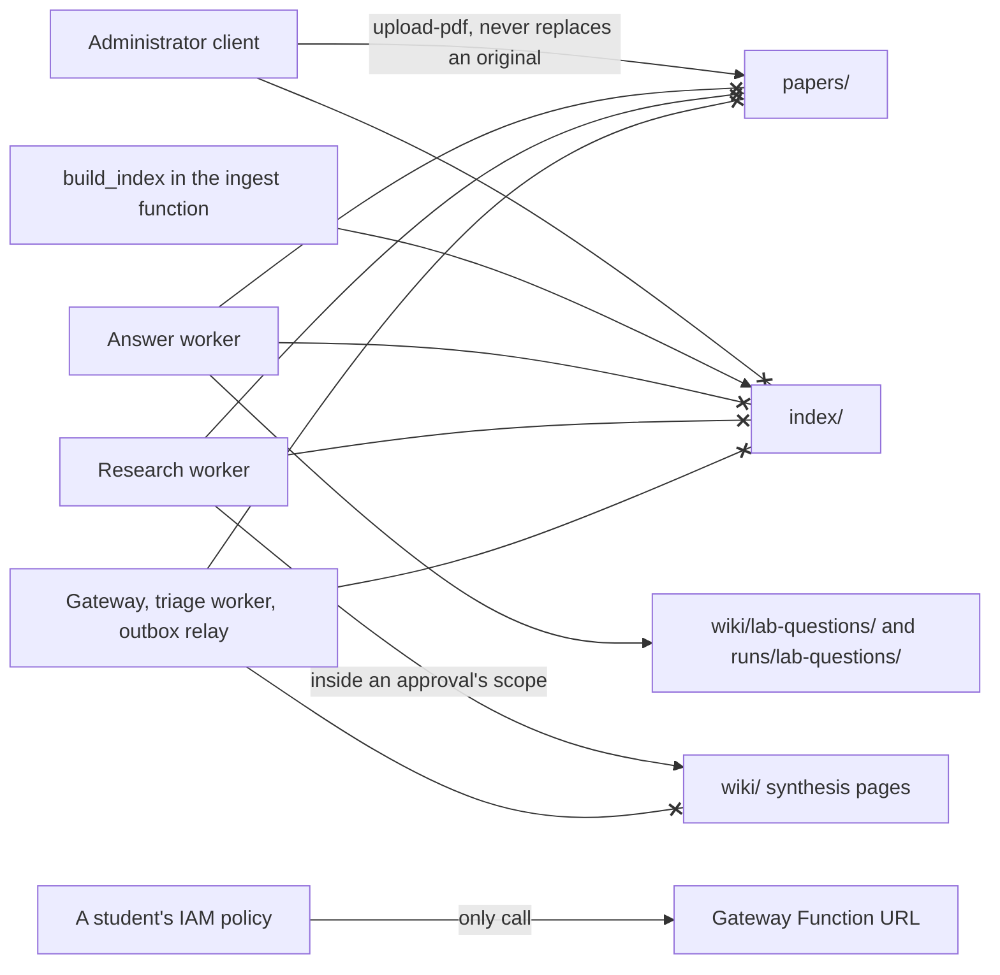
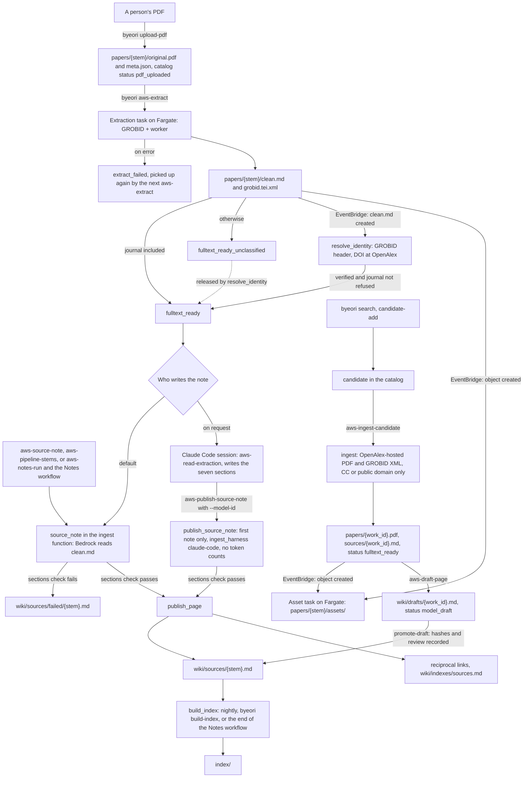
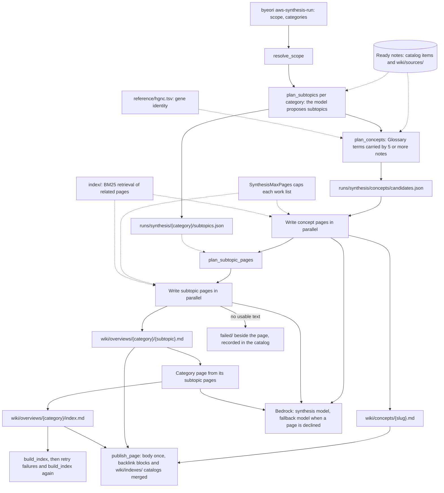
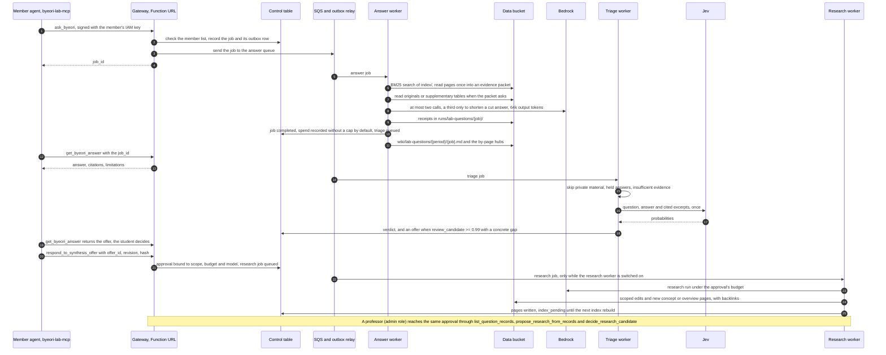
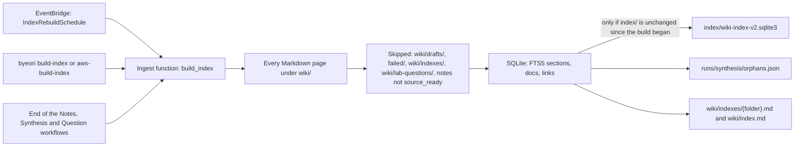
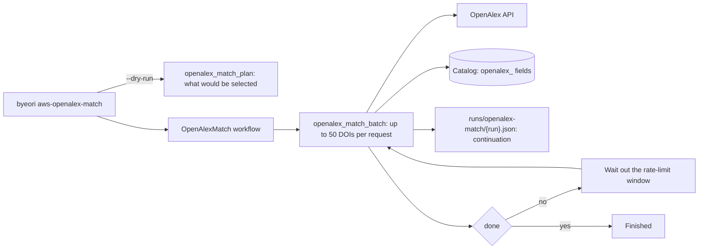
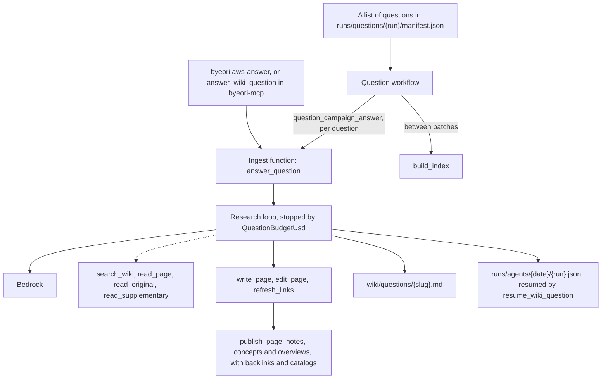

# Architecture

Byeori is two CloudFormation stacks around one S3 bucket. The main stack (`infra/template.yaml`)
takes papers in, writes the wiki and keeps the search index. The optional student stack
(`infra/lab-template.json`) lets lab members ask and read without administrator rights. All of the
work runs in AWS; a client (the `byeori` CLI or an MCP server) signs in, sends a request and reads
a bounded result. Nothing is mirrored on anyone's computer.

## One paper, one note

Each paper gets exactly one page of its own: its evidence note, `wiki/sources/{stem}.md`, written
from the paper's full text as extracted from the stored original. The note records the paper's
identifiers and the SHA-256 of the PDF it was read from, the model that wrote it, the paper's
methods and results as the paper states them, its limitations, and a line between what the paper
reports and what is interpretation. Everything else in the wiki (overviews, concepts, answered
questions) is synthesis across notes, and links back to the notes it cites.

## Storage layout

Everything lives in the data bucket. A paper's folder name, its `stem`, is built from its first
author, year and title.

| Key | What it holds |
|---|---|
| `papers/{stem}/original.pdf` | the original PDF, as uploaded, never overwritten |
| `papers/{stem}/meta.json` | the paper's identifiers, the PDF's hash and where it came from |
| `papers/{stem}/grobid.tei.xml`, `papers/{stem}/clean.md` | GROBID's structured extraction, and the Markdown text the model reads |
| `papers/{stem}/assets/` | figures and tables cut from the PDF, with their captions |
| `papers/{stem}/supplementary/` | the paper's supplementary files, when supplied |
| `wiki/sources/{stem}.md` | the evidence note: one per paper |
| `wiki/overviews/`, `wiki/concepts/` | synthesis pages across notes |
| `wiki/questions/` | answered research questions |
| `wiki/lab-questions/` | answers given through the student service; outside the search index |
| `wiki/indexes/`, `wiki/index.md` | browse catalogs, one per folder and field; outside the search index |
| `index/` | the BM25 search index, rebuilt in AWS from the pages (nightly and by `byeori build-index`) |
| `runs/` | receipts and ledgers: what each run did, read and cost |

The catalog table (DynamoDB) holds one record per paper, keyed by its stem or OpenAlex id, with
its status through the pipeline and each step's token counts.

## The main stack

| Piece | Service | What it does |
|---|---|---|
| Ingest function | Lambda | OpenAlex search and lookups, identity checks, evidence notes, answers, validation, the index rebuild |
| Synthesis function | Lambda | plans and writes pages across notes |
| Asset trigger | Lambda | starts the figure worker when a paper's text is stored |
| Extraction task | Fargate | GROBID: PDF to structured text, written back beside the PDF |
| Asset task | Fargate | cuts figures and tables out of the PDF (image in ECR) |
| Notes workflow | Step Functions | writes notes for many papers at once, resumable |
| OpenAlex match workflow | Step Functions | matches stored papers to OpenAlex records |
| Synthesis workflow | Step Functions | writes synthesis pages in parallel under a page cap |
| Question workflow | Step Functions | runs research questions in bulk under a per-question budget |
| Rules | EventBridge | the nightly index rebuild; the figure and identity steps after an extraction |
| Trail | CloudTrail | records every write to the synthesis pages, kept in a separate audit bucket |

The path of one paper: the PDF is stored under `papers/{stem}/`; an extraction task writes
`clean.md`; that write starts the identity check and the figure worker; the ingest function has
Bedrock write the note from `clean.md`; the index rebuild makes the note searchable.

## The student stack

| Piece | Service | What it does |
|---|---|---|
| Gateway | Lambda with a Function URL | checks the caller's IAM identity against the member list, records questions, serves bounded reads |
| Answer worker | Lambda, SQS queue | answers from a bounded evidence packet in at most two model calls |
| Triage worker | Lambda, SQS queue | asks Jev, after the answer, whether the question deserves synthesis; issues an offer at 0.99 |
| Outbox relay | Lambda, EventBridge timer | passes recorded work to the queues every minute |
| Research worker | Lambda, SQS queue | runs an approved synthesis inside the approved scope; off until `ResearchConsumerEnabled` is true |
| Control table | DynamoDB | members, questions, answers, offers, approvals, budgets |

## Write boundaries

Who may write what is enforced by IAM, not by the client's good behaviour:

- The index is built only in AWS; no client writes `index/`. Originals arrive in `papers/` only
  through the administrator's upload command, which refuses to replace an existing original.
  Nothing in the student service may write `papers/` or `index/`.
- The student gateway, the triage worker and the outbox relay write no wiki page at all; each role
  explicitly denies writes to `wiki/`, `papers/` and `index/`.
- The answer worker may write only its receipts (`runs/lab-questions/`) and answer pages under
  `wiki/lab-questions/`; its role denies writes to `papers/` and `index/`.
- The research worker writes synthesis pages only after a student accepted an offer or the
  professor approved a candidate, and only inside that approval's scope; it too is denied
  `papers/` and `index/`.
- A student's IAM policy allows one thing: calling the gateway's Function URL.

## How it works, in diagrams

The README carries short versions of these diagrams; the ones here are the detailed versions.
Every box and arrow is taken from the code in `src/byeori/` and the templates in `infra/`. Solid
arrows are calls and writes, dotted arrows are reads, and an arrow ending in `x` is a write that
IAM denies.

### Overall architecture

```mermaid
flowchart TB
    subgraph clients["Clients: sign in, send a request, read a bounded result"]
        admin["Administrator: byeori CLI or byeori-mcp"]
        member["Lab member: byeori-lab-mcp"]
    end
    subgraph mainstack["Main stack"]
        ingest["Ingest function"]
        synth["Synthesis function"]
        sfn["Step Functions: Notes, OpenAlexMatch, Synthesis, Question"]
        extract["Extraction task on Fargate: GROBID + worker"]
        assettrigger["Asset trigger function"]
        assets["Asset task on Fargate: figures and tables"]
        rules["EventBridge: nightly rebuild, clean.md stored"]
        catalog[("Catalog table, DynamoDB")]
        ssm["Parameter Store: OpenAlex key, Jev key"]
        trail["CloudTrail: writes to overviews, concepts, questions"]
    end
    subgraph bucket["Data bucket, S3"]
        papers["papers/{stem}/: original, extraction, assets, supplementary"]
        sources["wiki/sources/"]
        synthesis["wiki/overviews/ and wiki/concepts/"]
        questions["wiki/questions/"]
        labq["wiki/lab-questions/"]
        catalogs["wiki/indexes/"]
        index["index/: BM25 search index"]
        runs["runs/: receipts"]
    end
    subgraph labstack["Student stack, optional"]
        gateway["Gateway: Function URL, IAM auth, member list"]
        control[("Control table, DynamoDB")]
        queues["SQS queues and outbox relay"]
        answer["Answer worker"]
        triage["Triage worker"]
        research["Research worker"]
    end
    bedrock["Bedrock: Claude"]
    jev["Jev, external and optional"]

    admin -->|"upload-pdf"| papers
    admin -->|"aws-extract starts tasks"| extract
    admin --> ingest
    admin -->|"start a run"| sfn
    sfn --> ingest
    sfn --> synth
    extract -->|"clean.md, grobid.tei.xml"| papers
    rules -->|"clean.md created"| assettrigger --> assets -->|"assets/"| papers
    rules -->|"resolve_identity, build_index"| ingest
    ingest --> catalog
    ingest -->|"notes"| sources
    ingest -->|"answers"| questions
    ingest -->|"build_index"| index
    ingest --> catalogs
    ingest --> runs
    synth -->|"pages"| synthesis
    synth --> catalog
    ingest --> bedrock
    synth --> bedrock
    ssm -.-> ingest
    trail -.-> synthesis
    member -->|"signed request"| gateway
    gateway --> control
    gateway --> queues
    queues --> answer
    queues --> triage
    queues --> research
    answer -.->|"search and read"| index
    answer -->|"answer pages"| labq
    answer --> bedrock
    triage --> jev
    ssm -.-> triage
    research -->|"approved scope only"| synthesis
    research --> bedrock
```

Write boundaries, as the IAM roles enforce them (`infra/template.yaml`, `infra/lab-template.json`):

### Ingesting a paper

Two routes bring a paper in. A person's PDF is the usual one; OpenAlex discovery takes only
OpenAlex-hosted papers under a Creative Commons or public-domain licence. For a PDF the note is
written by Bedrock by default, or, on request, by a Claude Code session; everything else stays in
AWS either way.

`byeori aws-pipeline` runs the OpenAlex route (ingest, draft, promote) for every allowlisted
candidate. `byeori validate` checks the sections of every published page in AWS afterwards; it
reports and writes nothing.

### Synthesis

The Synthesis workflow plans and writes the pages that sit across notes: concept pages, subtopic
pages inside a category, and one category page written from its subtopic pages. It never rewrites
a note's text.

A page with more member notes than one call takes is written in partial pages of 15 notes, merged
15 at a time (`runs/synthesis/{folder}/partials/`). A note's own text is never regenerated by a
synthesis run: `publish_page` only merges a managed backlink block into the pages a new page cites,
and `wiki_backlinks` answers which pages cite a note from the index's links table.

### A member's question

### The nightly index rebuild

### OpenAlex matching

Matches the stored papers in the catalog to OpenAlex records by DOI. OpenAlex is metadata here,
not evidence: its values are stored under an `openalex_` prefix, and only a missing PMID or PMCID
is filled in.

### The administrator's research question

The administrator's questions run the research loop, which may read originals, revise pages and
write new ones, under a per-question budget (`QuestionBudgetUsd`). A student's question never
takes this path unless an offer was accepted or a professor approved it.

### Other flows

- **Category catalogs.** `byeori aws-build-category-catalogs` writes one browse page per field,
  `wiki/indexes/categories/{field}.md`, and their table `wiki/indexes/categories.md`, from the
  index. Like every page under `wiki/indexes/`, they stay out of the search index.
- **Supplementary files.** A paper's supplementary tables and documents sit in
  `papers/{stem}/supplementary/` with a `README.md` guide and a `manifest.json`; the research loop
  and the answer worker read them with `read_supplementary`. This beta has no command that adds
  them.
- **Receipts.** Each run leaves its record under `runs/`: `runs/notes/` and `runs/retry/` (Notes
  workflow), `runs/synthesis/`, `runs/openalex-match/`, `runs/agents/` (research traces),
  `runs/questions/` and `runs/lab-questions/{job}/` (student answers and triage).
- **Cost ledger.** `byeori cost-ledger` sums a local ledger in the clone's `state/` folder, which
  the CLI appends to after the steps it runs itself; it is an estimate from list prices, not a
  bill.
- **Hubs of answered questions.** `byeori aws-link-lab-questions --apply` adds one standing line
  to each indexed page pointing at its hub under `wiki/lab-questions/by-page/`.
- **Audit.** The CloudTrail trail records every write under `wiki/overviews/`, `wiki/concepts/`
  and `wiki/questions/` in a separate audit bucket.
